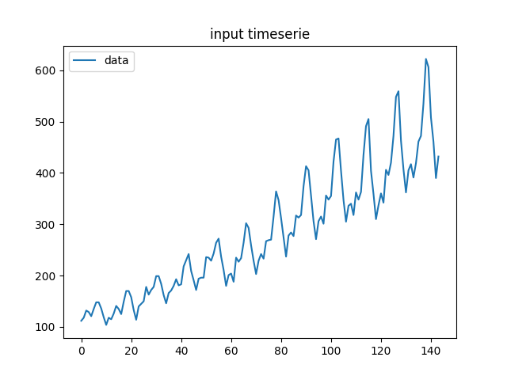
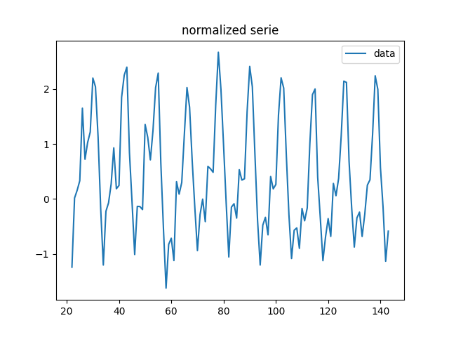
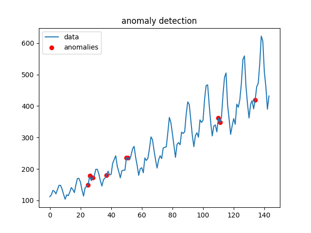
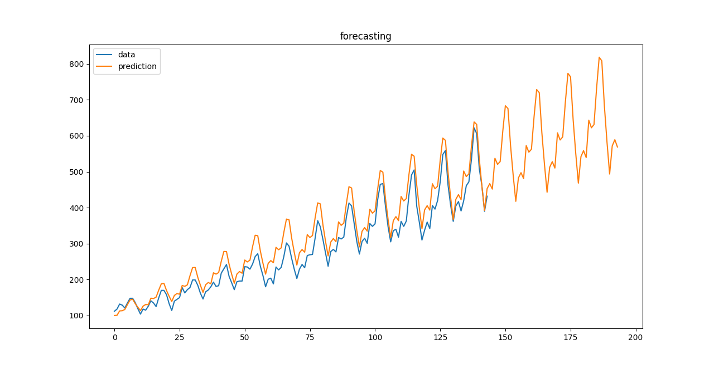

# Timeseries
Pipeline system that allows several successive operations to be performed on a series.
<br/>
<br/>
<br/>

## Available functions

#### Decomposition functions
 - **FindSeasons :** get periods presents in a timeserie
 - **Detrend :** remove trend from signal (need a period)
 - **Devariance :** remove variance from signal (need a period)
 - **Deseason :** remove seasonnality from signal (need a period)

#### Prediction functions
 - **PredictTrend :** predict trend of a timeserie
 - **PredictVariance :** predict variance of a timeserie
 - **PredictSeason :** predict seasonnal pattern of a timeserie
 - **MergePredictions :** merge all predicted components together

#### Anomaly detection functions
 - **ProbabilisticAnomalyDetector :** naïve anomaly detection on a timeserie
 
#### Plot functions
 - **PlotSerie :** add current serie to a graph
 - **ShowPlot :** show graph
 - **PlotAnomalies :** add anomalies plotting to a graph
<br/><br/><br/>

## Examples
For these examples, we took AirPassengers data (data can be found on this repository).  
<br/>
**Plot data**  
```
show_data_pip = Pipeline(PlotSerie(label='data'), ShowPlot(title='input timeserie'))
output = show_data_pip.fit(data)
```  

<br/><br/>
**Plot normalized data**  
```
normalize = Pipeline(FindSeasons(maxseasons=1), 
                     Detrend(), 
                     Devariance(),
                     PlotSerie(label='data'),
                     ShowPlot(title='normalized serie'))
output = normalize.fit(data)
```  

<br/><br/>
**Plot detected anomalies**  
```
anomaly = Pipeline(normalize,
                   PlotSerie(),
                   Deseason(),
                   ProbabilisticAnomalyDetector(p=0.05),
                   PlotAnomalies(),
                   ShowPlot()
                   )
output = anomaly.fit(data)
```  

<br/><br/>
**Forecast timeserie**  
```
predpip = Pipeline(FindSeasons(maxseasons=1),
                   PlotSerie('data'),
                   PredictTrend(n=50, degree=1),
                   PredictVariance(n=50, degree=1),
                   PredictSeason(n=50),
                   MergePredictions(),
                   PlotSerie('prediction'),
                   ShowPlot()
                   )
output = predpip.fit(data)
```  


<br/><br/><br/>

## Future work :
 - Add a deep autoencoder (for deseason, anomaly detector, prediction)
 - Rework prediction pipeline : actual system with MergePredictions sucks...
 - Add statistical models (Autoregressive models such as ARIMA, exponential smoothing, ...)
